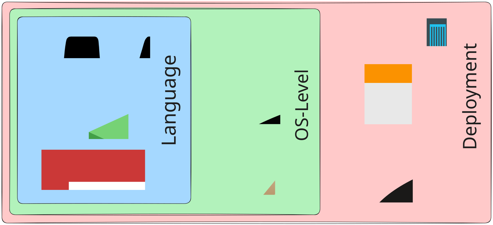
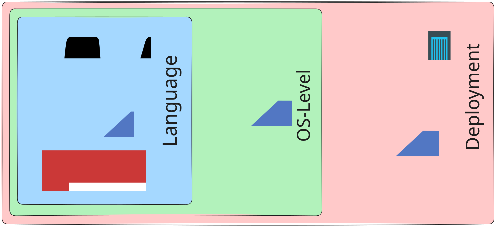

## 01
# Czym są menedżery pakietów?

---
layout: center
---

**brew** *(OS Level)* *instaluje Node.js i npm*
 -> 
**npm** *(Lang Level)* *instaluje zależności, buduje aplikację*
 -> 
**Docker** *(Deployment)* *tworzy kontener, uruchamia na serwerze*

---
layout: default
---

**Nix** *(OS Level)* *instaluje Node.js i npm*
 -> 
**npm** *(Lang Level)* *instaluje zależności, buduje aplikację*
 -> 
**Nix** *(Deployment)* *buduje obraz/pakiet, uruchamia na serwerze*