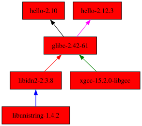

## 02
# Czym jest Nix?

---
layout: two-cols
---

# Podstawy języka Nix

```nix
# typy
42, 3.14, true false, null       # int, float, bool
"hello ${name}"                  # string
./rel       /nix/store           # ścieżka
[ 1 "dwa" (x: x) { x = 10; } ]   # lista
{ a = "hi"; b = { c.d = 10; }; } # attribute set

# let...in - lokalne zmienne
let x = 10; y = x * 2;
in x + y   # => 30

# inherit - skrót: name = name;
let name = "test";
in { inherit name; } # => { name = "test"; }

# with attrset; wnosi pola attrset do zasięgu
let c = { x = 1; y = 2; z = 3; };
in with c; x + y + z  # zamiast c.x + c.y + c.z
```

::right::

# &nbsp;

```nix
# funkcje
## 1. currying - częściowa aplikacja
addCurr = x: y: x + y; # x: (y: x + y)
addCurr 3 5            # => 8
addCurr3 = addCurr 3;  # zwraca funkcję: y: 3 + y
addCurr3 5             # => 8

## 2. destrukturyzacja attrset
addSet = { x, y }: x + y;
addSet { y = 3; x = 5; }  # => 8
# ? - domyślna wartość ... - ignoruje resztę
f = { x, y ? 0, ... }: x + y;
f { x = 5; z = 2; } # => 5

# łączenie obu
configure = system: { name, version }:
  "${name}-${version}-${system}";

configure "x86_64-linux" {
  name = "hello"; version = "2.12";
}
# częściowo:
forLinux = configure "x86_64-linux";
forLinux { name = "hello"; version = "2.12"; }
```

---
layout: default
---

Nix to **funkcyjny menedżer pakietów**.

- Pakiet = **czysta funkcja** swoich wejść: źródło + zależności + kroki budowania.<br>Te same wejścia -> ten sam wynik.
- Wszystko ląduje w ``/nix/store`` pod ścieżką z hashem -> wiele wersji obok siebie, zero konfliktów.
```bash {lines:false}
  /nix/store/zi2bj2hlavv8q743li2s9diqbcpmrf9b-hello-2.12.3
  |--------| |------------------------------| |----------|
store directory            digest                 name
```
- **Deklaratywność**: opisujesz co chcesz mieć, nie jak to ręcznie zbudować.

```nix {*|1|2-10|3-4|6-9|*} [package.nix] 
{ stdenv, fetchurl }:
stdenv.mkDerivation (finalAttrs: {
  pname = "hello";
  version = "2.12";

  src = fetchurl {
    url = "https://ftp.gnu.org/gnu/hello/hello-${finalAttrs.version}.tar.gz";
    sha256 = "1ayhp9v4m4rdhjmnl2bq3cibrbqqkgjbl3s7yk2nhlh8vj3ay16g";
  };
})
```

---
layout: two-cols
---

# Zmiana kodu = nowy hash

````md magic-move [package.nix] {at: 2}
```nix
stdenv.mkDerivation {
  pname = "hello";
  version = "2.12";
  src = fetchurl {
    url = "...hello-2.12.tar.gz";
    sha256 = "1ayhp9v4m4...";
  };
}
```
```nix
stdenv.mkDerivation {
  pname = "hello";
  version = "2.10";
  src = fetchurl {
    url = "...hello-2.10.tar.gz";
    sha256 = "0ssi1wpaf7...";
  };
}
```
````

::right::

# &nbsp;

````md magic-move [/nix/store] {at: 1, lines:false}
```bash
```
```bash
/nix/store/g54b6g...-xgcc-15.2.0-libgcc
/nix/store/bf6wga...-libunistring-1.4.2
/nix/store/6qa00c...-libidn2-2.3.8
/nix/store/57iz36...-glibc-2.42-61
/nix/store/zi2bj2...-hello-2.12.3
```
```bash
/nix/store/g54b6g...-xgcc-15.2.0-libgcc
/nix/store/bf6wga...-libunistring-1.4.2
/nix/store/6qa00c...-libidn2-2.3.8
/nix/store/57iz36...-glibc-2.42-61
/nix/store/zi2bj2...-hello-2.12.3
/nix/store/ax9kk1...-hello-2.10
```
````



---
layout: default
---

# ...nie tylko menedżer pakietów

- **Język Nix** - funkcyjny, dynamicznie typizowany DSL [nix.dev](https://nix.dev/tutorials/nix-language)
- **Nixpkgs** - ponad 100k pakietów [search.nixos.org](https://search.nixos.org)
- **NixOS** - dystrybucja Linuksa zbudowana wokół Nixa [nixos.org](https://nixos.org) 

